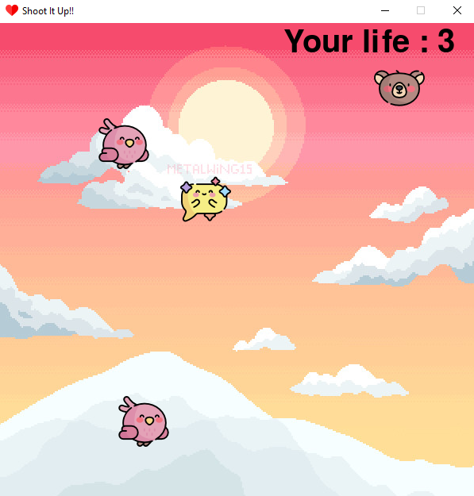

# Shoot-It-Up Game

The game name is Shoot It Up. It is made with pygame module provided by python. The basic consept of the game is to shoot the same species or characters. The user is given 3 lives to shoot all characters. 

